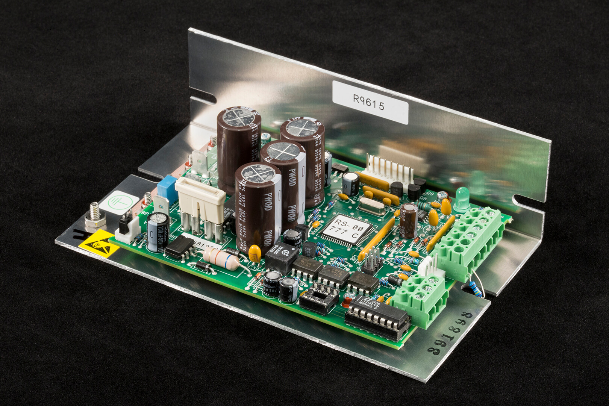

# TETechTC3625RS232.jl



The [TE Technology TC-36-25-RS232](https://tetech.com/product/tc-36-25-rs232/) device is a bi-polar proportional-integral-derivative temperature controller that can modulate power input to a thermolectric device. It communicates through an RS 232 port. This repository provides a julia package to communicate with the device. 

Authors: Markus Petters (mdpetter@ncsu.edu) and Sabin Kasparoglu (skaspar@ncsu.edu)

## Installation

```julia
pkg> add https://github.com/mdpetters/TETechTC3625RS232.jl.git
```

The package depends on LibSerialPort. Ensure that the user has access to the ports by adding the user to the dialout group.

```bash
sudo usermod -a -G dialout $USER
```

## Example Usage

No functions are exported by the module to avoid potential namespace collision with other devices. Thus all function calls are prefaced by TETechTC3625RS232. Note all programmable functions are currently implemented. However, the library is easily extended to implement the missing commands if needed.

```julia
# Load the package
using TETechTC3625RS232

# Configure the serial port. You can run list_ports() to enumerate 
# available ports on the system.
port = TETechTC3625RS232.configure_port("/dev/ttyUSB0")

# Read temperature from Input 1 and Input 2
T1 = TETechTC3625RS232.read_sensor_T1(port)
T2 = TETechTC3625RS232.read_sensor_T2(port)

# Turn on/off power output
TETechTC3625RS232.turn_power_on(port)
TETechTC3625RS232.turn_power_off(port)

# Set control temperature for controller-internal PID
# Controller responds with set value
Tset = TETechTC3625RS232.set_temperature(port, value)

# Read the thermistor type assumed by the controller
#    0: TS141 5K
#    1: TS67 OR TS136 15K
#    2: TS91 10K
#    3: TS165 230K
#    4: TS104 50K
#    5: YSI H TP53 10K
thermistor_type = TETechTC3625RS232.read_sensor_type(port)

# Set the thermistor type assumed by the controller to TS91 10K
#    0: TS141 5K
#    1: TS67 OR TS136 15K
#    2: TS91 10K
#    3: TS165 230K
#    4: TS104 50K
#    5: YSI H TP53 10K
# Controller responds with set value
thermistor_type = TETechTC3625RS232.set_sensor_type(port, 2)

# Readthe PID settings
P = TETechTC3625RS232.read_proportional_bandwidth(port)
I = TETechTC3625RS232.read_integral_gain(port)
D = TETechTC3625RS232.read_derivative_gain(port)

# Write PID settings - controller responds set values
P = TETechTC3625RS232.write_proportional_bandwidth(port, 5.0)
I = TETechTC3625RS232.write_integral_gain(port, 0.28)
D = TETechTC3625RS232.write_derivative_gain(port, 0.0)
```
